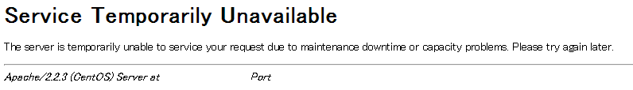

Gitlabを5.1から5.2へあげてみた
================================

前回の段階で5.2までリリースされていたけどバージョンアップは一つ一つあげていかないといけないのでひとまず5.1にしました。

そして今回は5.2へのバージョンアップ。

**結論から言うとはまりまくった**

何はともあれ手順はきっちりと記載されているGitlab。すばらしいね！

=======================
手順メモ
=======================

5.1から5.2へのアップグレードの手順は `ここ <https://github.com/gitlabhq/gitlabhq/blob/master/doc/update/5.1-to-5.2.md>`_

Stop server
--------------

.. code-block:: bash

 #sudo service gitlab stop
 /etc/init.d/gitlab start

自分はなれている下に書いてあるコマンドで実行

Get latest code
-----------------

.. code-block:: bash

 cd /home/git/gitlab
 sudo -u git -H git fetch
 sudo -u git -H git checkout 5-2-stable

上記を実行すると以下のようなエラーがでる

.. code-block:: bash

 error: Your local changes to the following files would be overwritten by checkout:
         db/schema.rb
 Please, commit your changes or stash them before you can switch branches.
 Aborting

以下を参考

http://d.hatena.ne.jp/koba04/20110130/1296377653

コミットしていない変更を退避しないといけないらしい。まだgitのことわかっていないな...

以下を実施

.. code-block:: bash

 git stash
 git checkout master

Update gitlab-shell
----------------------

.. code-block:: bash

 cd /home/git/gitlab-shell
 sudo -u git -H git fetch
 sudo -u git -H git checkout v1.4.0

Install libs, migrations etc
---------------------------------

.. code-block:: bash

 cd /home/git/gitlab
 sudo -u git -H bundle install --without development test postgres --deployment
 sudo -u git -H bundle exec rake db:migrate RAILS_ENV=production

上記のsudo -u git -H bundle install ?without development test postgres ?deploymentで以下のエラー

yumでは落として来れないのでソースからビルドしてインストール。いったん今入っているのをyum removeで消した方がいいかも

.. code-block:: bash

 cd /usr/local/src/
 wget http://download.icu-project.org/files/icu4c/4.2.1/icu4c-4_2_1-src.tgz
 cd icu
 ./configure
 make
 make install

インストールするディレクトリは適当に

ふたたびsudo -u git -H bundle install ?without development test postgres ?deployment実行

Start application
---------------------

.. code-block:: bash

 #sudo service gitlab start
 /etc/init.d/gitlab start

ふへ、ちょろいな

**! ?**

とりあえずGitlabのインストールがうまくいっているかチェックする。 `ここ参照 <https://github.com/gitlabhq/gitlabhq/blob/master/doc/install/installation.md#check-application-status>`_

.. code-block:: bash

 sudo -u git -H bundle exec rake gitlab:check RAILS_ENV=production

.. code-block:: bash

 Init script up-to-date? ... no
   Try fixing it:
   Redownload the init script
   For more information see:
   doc/install/installation.md in section "Install Init Script"
   Please fix the error above and rerun the checks.
 Projects have satellites? ...
 beautys4p-doc ... yes
 sandbox ... yes
 Redis version >= 2.0.0? ... yes
 Your git bin path is "/usr/bin/git"
 Git version >= 1.7.10 ? ... no
   Try fixing it:
   Update your git to a version >= 1.7.10 from 1.7.4
   Please fix the error above and rerun the checks.
  
 Checking GitLab ... Finishe

gitのバージョンが古い？なんかこれは直接の問題じゃなさそうだけど対処

.. code-block:: bash

 git clone https://github.com/git/git.git
 yum remove git
 cd git
 make configure
 ./configure  --with-curl --with-expat
 make
 make install
 
※--with-curl --with-expatを付けないとhttpsアクセスの際にエラーになる

もう一回確認

.. code-block:: bash

 sudo -u git -H bundle exec rake gitlab:check RAILS_ENV=production

.. code-block:: bash

 Running? ... no
   Try fixing it:
   sudo -u git -H bundle exec rake sidekiq:start RAILS_ENV=production
   For more information see:
   doc/install/installation.md in section "Install Init Script"
   see log/sidekiq.log for possible errors
   Please fix the error above and rerun the checks.

sidekiq:startに失敗している模様

以下/home/git/gitlab/log/sidekiq.log

.. code-block:: bash
 
 uninitialized constant Draper
 /home/git/gitlab/app/decorators_org/application_decorator.rb:1:in '<top (required)>'
 /home/git/gitlab/vendor/bundle/ruby/1.9.1/gems/backports-2.6.7/lib/backports/tools.rb:314:in 'require'
 /home/git/gitlab/vendor/bundle/ruby/1.9.1/gems/backports-2.6.7/lib/backports/tools.rb:314:in 'require_with_backports'
 /home/git/gitlab/vendor/bundle/ruby/1.9.1/gems/railties-3.2.13/lib/rails/engine.rb:439:in 'block (2 levels) in eager_load!'
 /home/git/gitlab/vendor/bundle/ruby/1.9.1/gems/railties-3.2.13/lib/rails/engine.rb:438:in 'each'
 /home/git/gitlab/vendor/bundle/ruby/1.9.1/gems/railties-3.2.13/lib/rails/engine.rb:438:in 'block in eager_load!'
 /home/git/gitlab/vendor/bundle/ruby/1.9.1/gems/railties-3.2.13/lib/rails/engine.rb:436:in 'each'
 /home/git/gitlab/vendor/bundle/ruby/1.9.1/gems/railties-3.2.13/lib/rails/engine.rb:436:in 'eager_load!'
 /home/git/gitlab/vendor/bundle/ruby/1.9.1/gems/railties-3.2.13/lib/rails/application/finisher.rb:53:in 'block in <module:Finisher>'
 /home/git/gitlab/vendor/bundle/ruby/1.9.1/gems/railties-3.2.13/lib/rails/initializable.rb:30:in 'instance_exec'
 /home/git/gitlab/vendor/bundle/ruby/1.9.1/gems/railties-3.2.13/lib/rails/initializable.rb:30:in 'run'
 /home/git/gitlab/vendor/bundle/ruby/1.9.1/gems/railties-3.2.13/lib/rails/initializable.rb:55:in 'block in run_initializers'
 /home/git/gitlab/vendor/bundle/ruby/1.9.1/gems/railties-3.2.13/lib/rails/initializable.rb:54:in 'each'
 /home/git/gitlab/vendor/bundle/ruby/1.9.1/gems/railties-3.2.13/lib/rails/initializable.rb:54:in 'run_initializers'
 /home/git/gitlab/vendor/bundle/ruby/1.9.1/gems/railties-3.2.13/lib/rails/application.rb:136:in 'initialize!'
 /home/git/gitlab/vendor/bundle/ruby/1.9.1/gems/railties-3.2.13/lib/rails/railtie/configurable.rb:30:in 'method_missing'
 /home/git/gitlab/config/environment.rb:5:in '<top (required)>'
 /home/git/gitlab/vendor/bundle/ruby/1.9.1/gems/sidekiq-2.11.1/lib/sidekiq/cli.rb:197:in 'require'
 /home/git/gitlab/vendor/bundle/ruby/1.9.1/gems/sidekiq-2.11.1/lib/sidekiq/cli.rb:197:in 'boot_system'
 /home/git/gitlab/vendor/bundle/ruby/1.9.1/gems/sidekiq-2.11.1/lib/sidekiq/cli.rb:39:in 'parse'
 /home/git/gitlab/vendor/bundle/ruby/1.9.1/gems/sidekiq-2.11.1/bin/sidekiq:7:in '<top (required)>'
 /home/git/gitlab/vendor/bundle/ruby/1.9.1/bin/sidekiq:23:in 'load'
 /home/git/gitlab/vendor/bundle/ruby/1.9.1/bin/sidekiq:23:in '<main>'

issueみたけど、当てはまるのなさそうな感じ

色々ためしたけど変わらず。ふとそういえば起動スクリプト/etc/init.d/gitlabって更新してないよなーと思いアップデートすることにしてみた

.. code-block:: bash

 # 前のを消して
 rm -f /etc/init.d/gitlab
 sudo curl --output /etc/init.d/gitlab https://raw.github.com/gitlabhq/gitlabhq/5-2-stable/lib/support/init.d/gitlab
 sudo chmod +x /etc/init.d/gitlab

再起動

.. code-block:: bash

 /etc/init.d/gitlab start

**動いた！！！！**

なんで！？

5.1と5.2のdiff

.. code-block:: diff

 --- gitlab5.1    2013-05-26 20:24:05.000000000 +0900
 +++ gitlab5.2    2013-05-26 20:24:56.000000000 +0900
 @@ -16,14 +16,15 @@
  
  APP_ROOT="/home/git/gitlab"
 -DAEMON_OPTS="-C $APP_ROOT/config/puma.rb -e production"
 +APP_USER="git"
 +DAEMON_OPTS="-C $APP_ROOT/config/puma.rb"
  PID_PATH="$APP_ROOT/tmp/pids"
  WEB_SERVER_PID="$PID_PATH/puma.pid"
  SIDEKIQ_PID="$PID_PATH/sidekiq.pid"
  STOP_SIDEKIQ="RAILS_ENV=production bundle exec rake sidekiq:stop"
  START_SIDEKIQ="RAILS_ENV=production bundle exec rake sidekiq:start"
  NAME="gitlab"
 -DESC="Gitlab service"
 +DESC="GitLab service"
  
  check_pid(){
    if [ -f $WEB_SERVER_PID ]; then
 @@ -36,6 +37,10 @@
    fi
  }
  
 +execute() {
 +  sudo -u $APP_USER -H bash -l -c "$1"
 +}
 +
  start() {
    cd $APP_ROOT
    check_pid
 @@ -45,8 +50,8 @@
      exit 1
    else
      if [ `whoami` = root ]; then
 -      sudo -u git -H bash -l -c "RAILS_ENV=production bundle exec puma $DAEMON_OPTS"
 -      sudo -u git -H bash -l -c "mkdir -p $PID_PATH && $START_SIDEKIQ  > /dev/null  2>&1 &"
 +      execute "RAILS_ENV=production bundle exec puma $DAEMON_OPTS"
 +      execute "mkdir -p $PID_PATH && $START_SIDEKIQ  > /dev/null  2>&1 &"
        echo "$DESC started"
      fi
    fi
 @@ -58,7 +63,7 @@
    if [ "$PID" -ne 0 -a "$STATUS" -ne 0 ]; then
      ## Program is running, stop it.
      kill -QUIT `cat $WEB_SERVER_PID`
 -    sudo -u git -H bash -l -c "mkdir -p $PID_PATH && $STOP_SIDEKIQ  > /dev/null  2>&1 &"
 +    execute "mkdir -p $PID_PATH && $STOP_SIDEKIQ  > /dev/null  2>&1 &"
      rm "$WEB_SERVER_PID" >> /dev/null
      echo "$DESC stopped"
    else
 @@ -74,9 +79,9 @@
    if [ "$PID" -ne 0 -a "$STATUS" -ne 0 ]; then
      echo "Restarting $DESC..."
      kill -USR2 `cat $WEB_SERVER_PID`
 -    sudo -u git -H bash -l -c "mkdir -p $PID_PATH && $STOP_SIDEKIQ  > /dev/null  2>&1 &"
 +    execute "mkdir -p $PID_PATH && $STOP_SIDEKIQ  > /dev/null  2>&1 &"
      if [ `whoami` = root ]; then
 -      sudo -u git -H bash -l -c "mkdir -p $PID_PATH && $START_SIDEKIQ  > /dev/null  2>&1 &"
 +      execute "mkdir -p $PID_PATH && $START_SIDEKIQ  > /dev/null  2>&1 &"
      fi
      echo "$DESC restarted."
    else
 @@ -89,7 +94,7 @@
    cd $APP_ROOT
    check_pid
    if [ "$PID" -ne 0 -a "$STATUS" -ne 0 ]; then
 -    echo "$DESC / Unicorn with PID $PID is running."
 +    echo "$DESC / Puma with PID $PID is running."
      echo "$DESC / Sidekiq with PID $SPID is running."
    else
      echo "$DESC is not running."

うーむ、Sidekiqあたりで変更が入っているけどなんでだろう。issueでtmp/pids/sidekiq.pidのパーミッションエラーっていうのがあって似たような対処してたけどそれかな？

**追記**

上の手順で

.. code-block:: bash

 Running? ... no
   Try fixing it:
   sudo -u git -H bundle exec rake sidekiq:start RAILS_ENV=production
   For more information see:
   doc/install/installation.md in section "Install Init Script"
   see log/sidekiq.log for possible errors
   Please fix the error above and rerun the checks.

となっていて

.. code-block:: bash

 bundle exec rake sidekiq:start RAILS_ENV=production

を実行していなかったことが原因だったぽい

上記を実行しているのがinitスクリプトというのが真相かな

|

----

===============
まとめ
===============

基本的にはドキュメントどおりでできる。ただし推奨環境はDebian系なのでドキュメントどおりでないところもある。

あと関係ないけど、OSそろそろCentOS5系はやめようかな

----

..

.. author:: default
.. categories:: Gitlab
.. tags:: Gitlab
.. comments::
