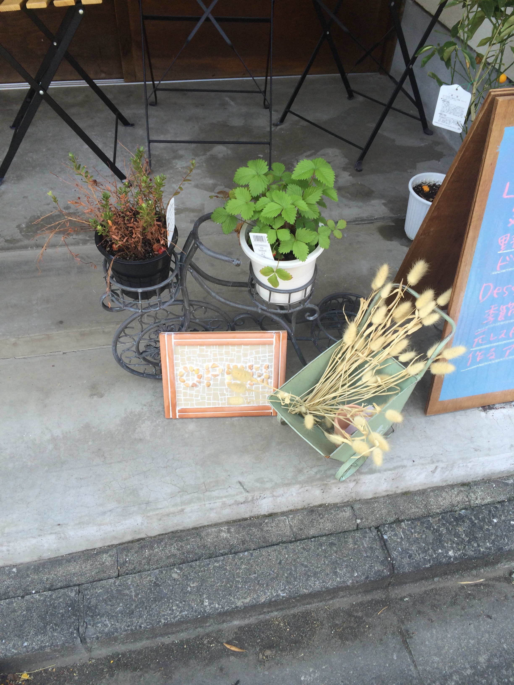
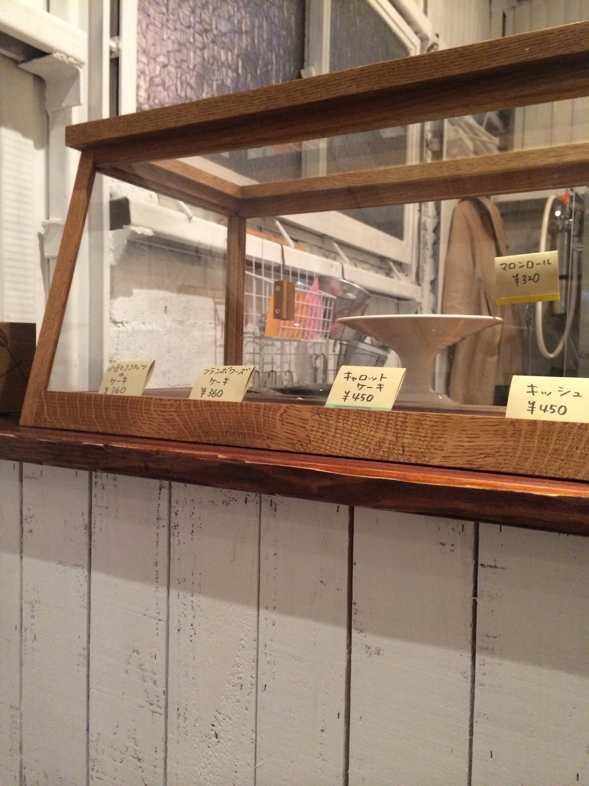
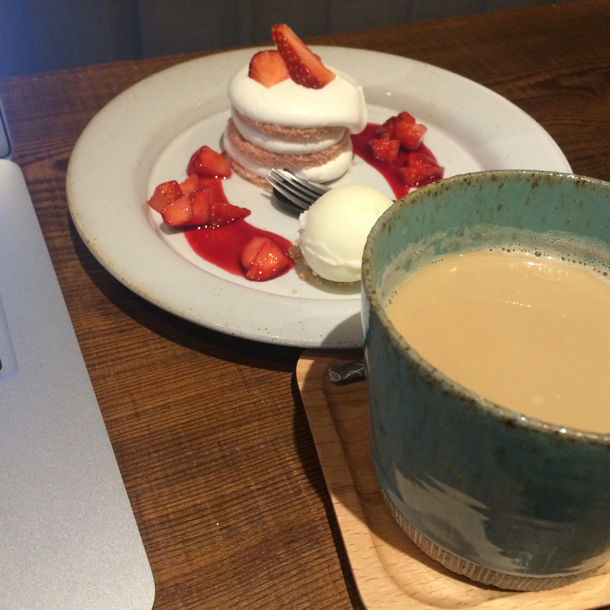
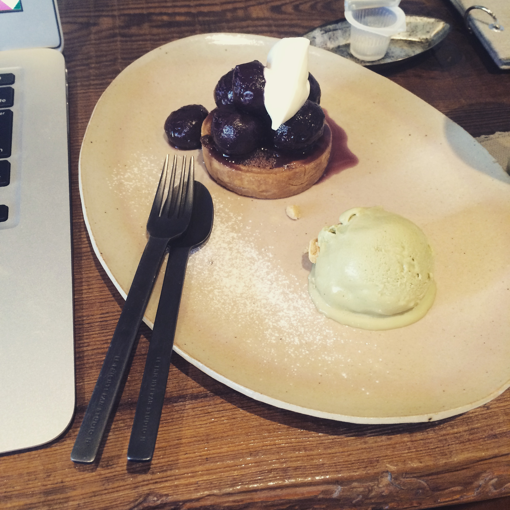
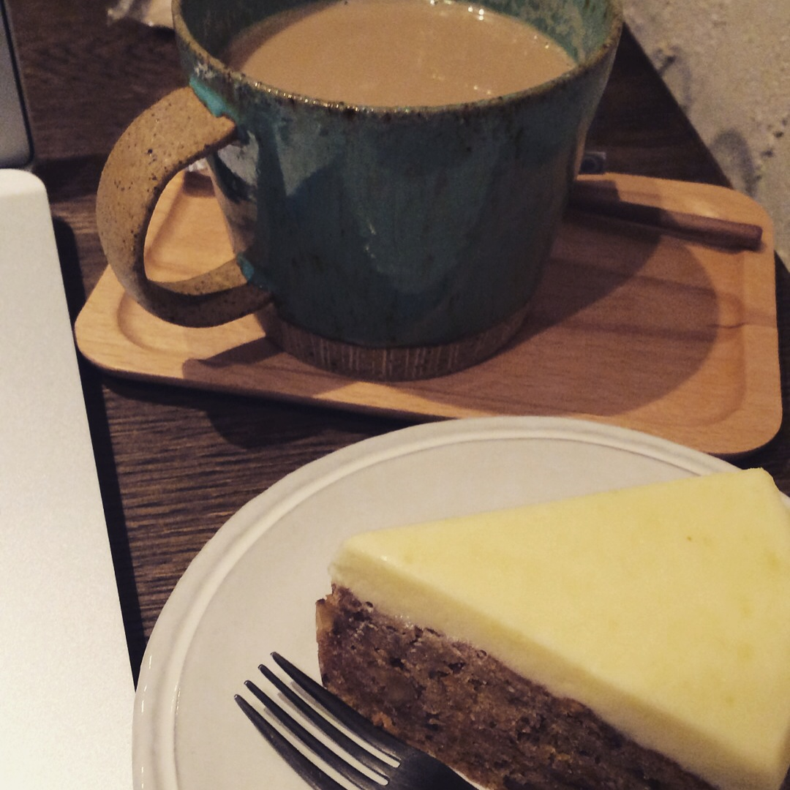
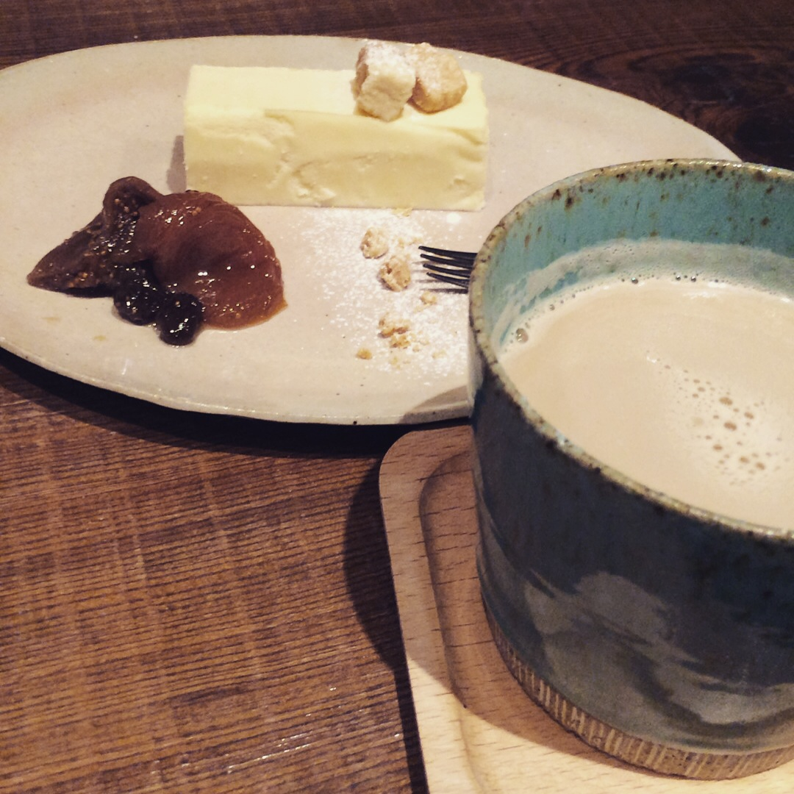
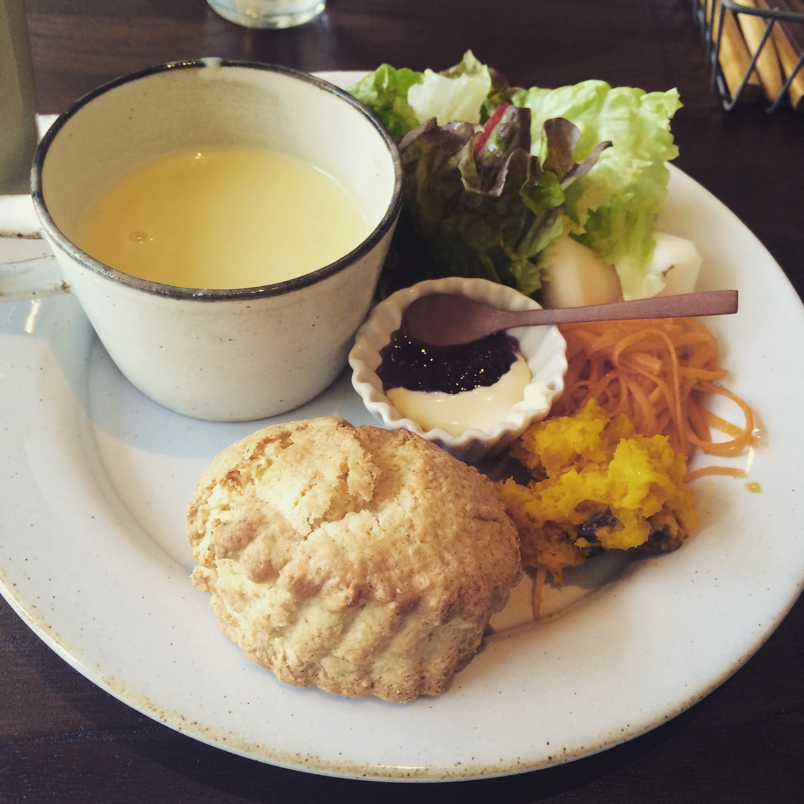

Patisserie Cafe aminchi
==========================

東京都世田谷区松原駅近くにあるパティシエさんがやっているカフェ。

`Patisserie Cafe aminchi <http://tabelog.com/tokyo/A1318/A131809/13173543/>`__

とても小さなカフェですが、静かな時間が過ごせるのでとても気に入っています。

ちょっとだけ雰囲気を紹介します。

.. more::

外観・内装
------------

.. image:: ../../../_image/aminchi/aminchi01.jpg
   :scale: 10

.. image:: ../../../_image/aminchi/aminchi03.jpg
   :scale: 10

.. image:: ../../../_image/aminchi/aminchi04.jpg
   :scale: 10

.. image:: ../../../_image/aminchi/aminchi06.jpg
   :scale: 10

ケーキ
------

ケーキは毎月変わります。

.. takkumattsu:: ガトーフレーズ
   :align: right

.. image:: ../../../_image/aminchi/aminchi08.jpg
   :scale: 10

.. takkumattsu:: チョコレートケーキ
   :align: right

.. takkumattsu:: ダークチェリーのタルトレット
   :align: right

.. image:: ../../../_image/aminchi/aminchi11.jpg
   :scale: 10

.. takkumattsu:: 名前忘れちゃった_(┐「ε:)_
   :align: right

.. takkumattsu:: 名前忘れちゃった_(┐「ε:)_
   :align: right

.. takkumattsu:: モワルーショコラ 
   :align: right

.. image:: ../../../_image/aminchi/aminchi14.jpg
   :scale: 23 

.. takkumattsu:: モンブラン
   :align: right

ランチプレート
---------------

キッシュかマフィンを選べます。

まとめ
=======

まったり過ごせる素敵なお店です。

是非、世田谷線に乗った時などに立ち寄ってみてください。

.. author:: default
.. categories:: その他
.. tags:: その他
.. comments::
